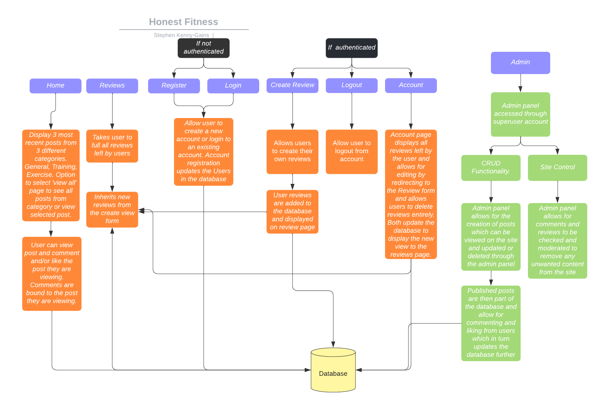
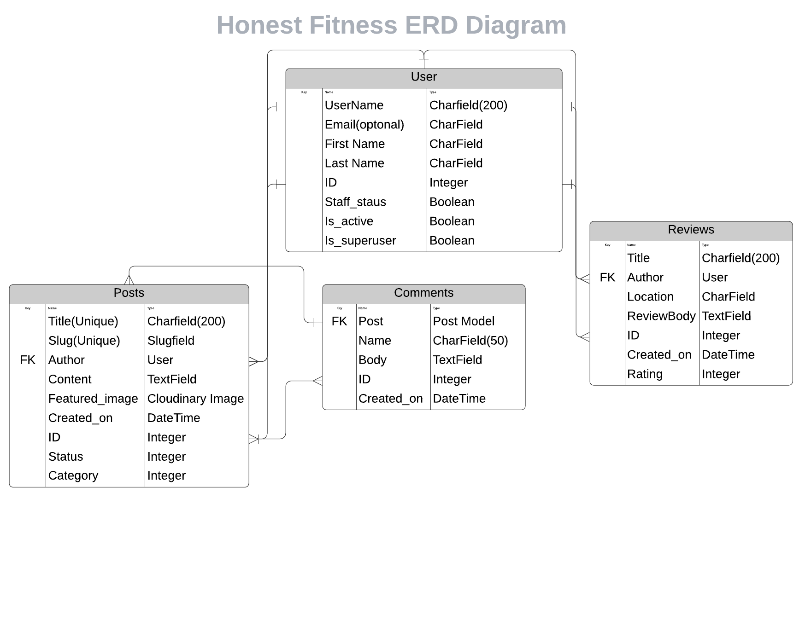

# [Honest Fitness](https://honestfitness.herokuapp.com/) 

Honest Fitness is a blog page offering free advice and guidance on their exercise and fitness goals.

The blog is divided in to 3 categories of posts, General, Training and Exercise.

General focuses on common topics, Training focuses on structure to workouts and habits and Exercise focuses on common exercise mistakes and best practise.

The review section is for users to leave reviews on people or places such as gyms they have been to or trainers they have used to help guide others towards valuable resources in the fitness community.

Users of the site can view all posts, reviews and comments left by the authors and users but can only post to the site if they are a registered user.

All reviews and comments left by users can be updated or deleted by the user and admin to avoid any hateful, negative or derogatory content being published to the site.

## Table of contents

- [UX and UI](#ux-and-ui)
    - [Design](#design)
    - [Agile and User Stories](#agile-and-user-stories)
    - [Site goals](#site-goals)
    - [User goals](#user-goals)
    - [Admin goals](#admin-goals)
    - [Flowchart](#flowchart)
- [Features](#features)
    - [Existing Features](#existing-features)
    - [Features Left To Implement](#features-left-to-implement)
- [Database](#database)
- [Testing](#testing)
    - [Python](#python)
    - [User Testing](#user-testing)
    - [Lighthouse](#lighthouse)
- [Code Validation](#validator-testing)
- [Unfixed Bugs](#unfixed-bugs)
- [Deployment](#deployment)
- [Credits](#credits)
- [Content](#content)
- [Media](#media)

## UX and UI

## Design

The design of the site is based around simplicity for the user and a calming colour scheme. The reason this was chosen was that from my time in the fitness industry, many people who are struggling to find results they are looking for and thus come to a site such as this can be frustrated, angry or intimidated by the industry. To combat this i chose a light blue colour palette to go with the site aim and community orientated experience. 

  - ### Wireframes

    - The wireframes for the site can be viewed in the drop down bar below;

Wireframes Desktop

Wireframes Mobile

  - ### Site view

    - The site view can be viewed in the screenshots in the drop down bars below for comparison to the wireframes above;

  

  
Screenshots Desktop

  

  

  

  

  

  

  

  
Screenshots Mobile

  

  

  

  

  

  

 - ### Header Navbar

    - The header and nav bar was kept simple to allow for easy navigation of the site and responds to whether or not the user has a loggin in status. Colours which both contrasted the the navabar but compliment the body were used for consistant design.

    

 - ### Footer

    - The footer was kept very minimal with only a link to my own github account and linkedin page. The bright colour to the icons contrasts the footer primary colour while still blending with the overall site body colour. I wanted to avoid any user information overload and so kept to only icons in this view.

    

 - ### Comments

    - The comments section is kept to just a body of the comment and there is no additonal information required and as pictured below, owners of the comment will be shown a thrash can icon so they can delete their own comments.

    

 - ### Palette

    - Below is the colour palette used for the site to give a calming effect to the user. This is hihgly in contrast to standard fitness and gym colour schemes which often use, dark and vibrant purples, deep reds and strong orange colours for the more energetic colour schemes. As I want my site to be geared towards those who are seeking advice and help, I chose to avoid these colour patterns for ditinguishing the site intention and illiciting a different emotional response.

    

  - ### Fonts

    - Fonts were taken from Google Fonts and the fonts used were Roboto and Lato

## Agile and User Stories

Following an Agile approach to the project I developed my user stories and project through the Github projects section which can be found here [Honest Fitness Project](https://github.com/StephenKennyGains/HonestFitness/projects). The user stories are as follows;

  - USER STORY: Manage Comments and Feedback
    - As a Admin I can Review comments for posting so that I can remove unhelpful or offensive comments

  - USER STORY: Manage Posts As a Admin I can create, read, update and delete posts so that I can create and continually update the content of the page

  - USER STORY: Comment on Posts As a User I can Comment on posts so that I can engage with the author and other users

  - USER STORY: See Comments As a User I can see others comments so that I can see peoples reactions and join conversations

  - USER STORY: Delete Comments As a User I can Delete my comments so that I can remove comments I no longer want visible on the site

  - USER STORY: See All Posts As a User I can find all posts so that I can view the full content of the site

  - USER STORY: View Posts As a User I can Select particular posts to read so that I can read them in full view

  - USER STORY: Reviews Admin As a Admin I can manage reviews left by users so that I can ensure they are not offensive or ungelpful to others

  - USER STORY: Reviews As a User I can submit a review of people or places so that I can help other to find helpful resources

  - USER STORY: Update and Delete Reviews As a User I can update and delete reviews so that I can update and remove my opinion if I change my mind or feel this is no longer    helpful

  - USER STORY: Register Account As a User I can sign up to an account so that I can engage with posts further than reading and create reviews

The overall ambition for the site was to have a page that was easy to navigate for users so that they could find content specific to their needs with minimal navigation through unwanted content. Due to the the nature of the content, users will have a topic in mind that they are searching for information on and so in the design of the project I decided to filter posts by category so that users could easily navigate to the content most relevant to them. The categories I chose were General, Training and Exercises. The reasons behing those descisions are as follows,
- Blog Section
  - General
    - Those who are into fitness and already have some what of a handle on their current training, enjoy reading up on different perspectives on common issues an topics. For that reason I chose to have the general category where posts could be easy reads and would potentially be shared to others. I want the category to be a place to voice my own opinions on common topics of fitness and allow others to contribute to those issues or topics
  - Training
    - The training topic has a more specific target audience where posts will be geared towards giving advice on training methodology. Topics will include, correct splits for muscle building, how to train for endurance and correct workout structure for strength etc. As this will be a more specific category, the target audience are those who are either new to training, have been having difficulty with their training or are maybe looking to change the way to train to optimise their input to results ratio.
  - Exercise
    - The exercise category focuses towards the most specific category which would be beginner to intermediate trainers who are unsure whether or not they are doing an exercise correctly. As this group will be expected to have a lesser knowledge of fitness, posts will be written to match this and should be simplistic and easy to understand for those who are unsure of more complex terminology which can be a common fault of fitness proffessionals to over complicate simple tasks.

- Review Section
The review section was chosen specifically for the purpose of creating a more community based feel to the site. As fitness can be an intimidating field for many people who are either new to it or are currently struggling in it, having reviews of facilities, trainers or organisations left by real life users can help to feel likee the site is a place for people to share ideas and feelings in the industry. As people's opinions on gyms and trainers could easily chane, it was important to add the feature of being able to edit or entirely delete reviews left by users and the admin. 

- The removal of likes
Initially I had intended on including like functionality to the site and had implemented it into blog posts and when contemplasting including it in the reviews category too, I changed my mind on ahving any like functionality. As many platforms have done such as instagram where likes can be given but the total number of likes cannot be viewed, I chose to remove likes from the site so that users would not be influenced on what content was releavant to them. This decision was made based on my current view on the fitness industry as a whole from my extensive background in this field. Unfortunately it is more common for people to follow workout and fitness advice from social media influencers than from qualified industry professionals and thus I made the decision to remove any block from a user finsing content that could be helpul to their needs.

- Adding a profile page
The ability to both update and delete reviews was originally implemented to be on the review page itself and for two reasons this was changed to be displayed on a new page. Firsly, if muliple reviews had been left and a user had left an early review, the user would have to navigate throughall other reviews to find their own which was a poor user experience. Secondly, the reviews left by that user would have an update and delete button attached to them which changed the page design and was not as asthetically pleasing as having all reviews uniform. When a user visits their profile page, only reviews left by them will be displayed here for editing and deletion and thus keeps all cards uniform in the section.

## Site goals

The site aim for Honest Fitness is for a simplistic fitness blog for users to learn more information about their training habits and common mistakes. To simplify the experience the site has been categorized so users can easily jump to sections that are of more interest to them than other. Users can engage in the site through commenting on posts and leaving reviews on people or places related to fitness. The site should be easily navigated by users and content should be easy to read and functionality like commenting, liking and reviewing should be simplictic and error free to the users.

## User goals:
- All user stories were created and implemented using an agile approach to the project and can be found in the project section of the Honest Fitness Repository hosted on Github using a standard Kanban board [Honest Fitness Project](https://github.com/StephenKennyGains/HonestFitness/projects)
- In additon to the User stories linked above, below are the additional site goals for users
- The user should feel that the site is easy to navigate and that content is easy to filter through to find relevant content.
- The user login, registration and logout functionality should be seamless, match the style of the site and have no errors in the process.
- Users should feel that they can easily engage with the site and other users of the site without any unnecessary blocks or hassle.

## Admin goals:
- All admin stories were created and implemented using an agile approach to the project and can be found in the project section of the Honest Fitness Repository hosted on Github using a standard Kanban board [Honest Fitness Project](https://github.com/StephenKennyGains/HonestFitness/projects)
- As an admin, the site should be seamless to control and moderate with CRUD functionality to be easily implemented.
- The admin panel via Django should make the creation of the site easy for the admin and allow for constant updating and moderation of the site.
- The admin should be able to easily control the content uploaded by users to ensure that the site is kept to a standard and is free from unwanted and unnecessary content uploaded from users. 

## Flowchart

The flowchart for this program was made on LucidChart. The flowchart takes you through the users path and navigation of the site divided by sections and showing what information is updated and pulled from the database as the user engages with the site. Additionally the admin engagament is shown seperately to show the construction of the content and the way data is developed and then passed to the users through CRUD fucntionality. 

## Features

The application has been kept simple to allow for easy navigation for users through both the content and site structure. While having the ability to interact with the site, some level of moderation is still required and so the features for both the user and admin are outlined below. 

### Existing Features

- __Blog Post Views__

  - The main aspect of the site is the blog post content and to keep the content streamlined to the user it has been categorized into three different categories. The categories are General, Training and Exercise. This allows users to self filter to sections of the site which are more appealing to the them as not all users will be interested in each category of post.

- __Categorized Post Pages__

  - As the home page is limited to the 3 most recent posts for each category to limit the content of the home page and avoid having a visual overload to the user, there is a button placed below each category for users to then view a seperate page containing all posts from a particular category ordered from latest to oldest so recurring users can easily view the most recent and up to date posts.

- __Full View Posts__

  - To allow users to view the blog post in a full, unobstructed manner, each blog post will redirect users to a new template which will show only the post and the site header and footer. This view is also where users habve the option to comment on them to interact with the posts. Comments related to each post will be displayed in this view. The comments will be ordered from oldest to newest to that users can view the comments in order as a conversation. The option to comment will be in a from directly above the post comments so that it is easy to find for new users. Users that are not logged in or registered will be shown a direction to the login or sign up section of the site. Once commented, only if a user is the owner of that comment, a delete button will be displayed so that users can remove comments they no longer want on the site.

- __Reviews Page__

  - The Reviews page will feature both Admin created reviews and user created views which will display as cards and give the review title, location, review and a rating between 1-5 stars. The option for users to review themselves will be dependant on their logged in status. Only when logged in as a user will the Create Review tab be displayed so that registered users can give their own opinions. The decision to have the create review page seperate from the review page was for ease of CRUD functionality.

- __Create Reviews Page__

  - The create review page is a simple form that asks the user for the title of their review, the location, the review and a star rating from 1-5. The form has placeholder text to give the user a better idea of the structure they should use for the Review. After submitting the review the user will be redirected to the Reviews page so they can see their review has been sent to the page and will also be displayed in their profile section. 

- __Edit Reviews Page__

  - To edit reviews the user can navigate to their profile where reviews they have left can be accessed. 

- __Profile Page__

  - The profile page is where users can update and/or delete reviews they have left. The reason behind creating a seperate page for this was for the design aspect of the site and for user accessibility. Originally the update and delete function of the reviews was going to be directly on the reviews page but after adding more reviews to the page, I realised that if a user had left a review a long time ago they would then have to navigate to that review through all others and this felt like poor user experience. In addition to that, the reviews they hd left would look slightly different to those left by other users as they would display an update and delete button which felt like a lesser design than having them in a seperate page for easy access where all posts would then look the same as only posts by that user would be displayed and so would all have the same design.

### Features Left to Implement

- I would like to include a feature for users to ask for feedback anonymously by way of a form which requests the users current problem, training summary, nutritional summary and other relevant details which would then be used to post as a new blog post under another category of real life stories.
- I would like to add a feature which uses a ggogle maps API which will display the location of gyms, trainers and organisations left by users reviews so that other users who are keen to avail of the services of those reviews can see if they are readily available to them.
- A feature for users to be able to like others comments would be a nice additonal feature so that there is a more community feel to the site encouraging conversation between both the users and admin.
- I would like to add to the profile page to include comments left by users and display the post they are related to for the same reason as the review edit function so that users can easily find the comments they have left and delete them if required.

## Database

- Below is my ERD for the project. It is contained to just the User, Post, Comment and Review model. Connections are shown through the model below for which models are inter linked and inherit from one another. The Post model is used for displaying posts to the site, categorizing them and displaying the post full view. Comments are directly linked to their associated post through their model. The review model is used for the creation, updating and deleting of reviews through the Review Page, Create Review page and Edit Review page found in the profile section. The user model created in Django allows for user content to be directly associated with the user and so allows for custom display and functionality and CRUD operations for the user. Without it there would be no ability for CRUD functionality on the users end and would only be available to an admin.

## Testing 

### __Python Testing__

- Due to issues I encountered when trying to run python testing through django, only some aspests of the project have automated testing included. Tests can be found in the file directories with the prefix of tests followed by the feature to be tested. 

### __User Testing__

- As automated testing ran into issues, manual testing of the site was required. To do this, I tested the site manually, naviagting through each section of the site to find errors in multiples media formats for issues with display, form submission, url redirection and ensuring authentication features were valid and performing as expected. In addition I asked two seperate users to test the site on both mobile and desktop to try and find any issues or design faults. No errors were reported back and manual testing of any additional features will be carried out if automated testing issues persist.

### __Lighthouse__

- The lighthouse report was brought down by similar recurring issues around the images used in the site as they are posted directly from the post created in the django admin and summernote fields, alt tags do not seem to registering to the images as a generic tag was used and not reported on.

### Validator Testing

- HTML Testing
  - All templates were tested using the [W3C](https://validator.w3.org/) validator. As the validator does not recognise tamplate literals as valid HTML formatting, the sections containing django speciic content were manually removed and after removal, all validation tests passed on each template.

- CSS Testing
  - CSS testing detected no errors through the [Jigsaw](https://jigsaw.w3.org/css-validator/) validator from W3C.

- Python
    - No errors were returned when passing through the official [PEP8](http://pep8online.com/) website. Only issues detected were through line too long errors and have been updated and corrected to ensure all files passed through validation. 

## Unfixed Bugs

- There are no unfixed bugs at present.

## Deployment 

### Heroku Deployment
- Ensure all dependancies such as third party libraries are listed in your requirements.txt file using the command pip3 freeze --local > requirements.txt
- Ensure all code is correct and ready for deployment.
- Log into Heroku.
- Click "New" and select "create new app" from the drop-down menu. This is found in the upper right portion of the window.
- Provide a name for your application, this needs to be unique, and select your region.
- Click "Create App".
- Navigate to "Resources" tab.
- Click on Resources and Search for Heroku Postgres and select it on the list to add to the project.
- Navigate to the "Deploy" section.
- Scroll down to "Deployment Method" and select "GitHub".
- Authorize the connection of Heroku to GitHub.
- Search for your GitHub repository name, and select the correct repository.
- Navigate to the settings tab
- Select revel config vars and add the following,
  - Your Cloudinary URL, your Database URL form the Heroku Postgres and your SECCRET_KEY.
- For Deployment there are two options, Automatic Deployments or Manual.
- Automatic Deployment: This will prompt Heroku to re-build your app each time you push your code to GitHub.
- Manual Deployment: This will only prompt Heroku to build your app when you manually tell it to do so.
- Ensure the correct branch is selected "master/Main", and select the deployment method that you desire. In this case, I will be using Automatic Deployment.

### Clone Repository
- On GitHub go to the main page of the Repository.
- Above the list of files click the code button with the drop-down arrow.
- To clone the repository using HTTPS, under "Clone with HTTPS", click on the clipboard.
- Open the Git Bash terminal.
- Change the current working directory to the location where you want the cloned directory.
- Type git clone, and then paste the URL you copied earlier from step 3.
- Press Enter to create your local clone.

## Credits 

 - I would like to give huge credit to the Code Institute support team. I ran into a few issues that I could not resolve after a few hours of trouble shooting and was given excellent guidance and help to be able to continue with my project.
 - Thanks to my mentor Adegbenga Adeye for all his help as I changed my project plan a few times due to unforseen circumstances through the months leading up to the project.
 - The following channels were used for a better understanding of django and to implement CRUD features for users,
    - [Very Academy](https://www.youtube.com/channel/UC1mxuk7tuQT2D0qTMgKji3w)
    - [Codemy](https://www.youtube.com/channel/UCFB0dxMudkws1q8w5NJEAmw)
    - [Dennis Ivy](https://www.youtube.com/channel/UCTZRcDjjkVajGL6wd76UnGg)

### Content 

- No additional content has been added to the project apart from the media listed below.
- Project Resources are as follows:
  - Adobe XD for Wireframes
  - LucidChart for Flowcharts and ERD
  - Multi Device Website Mockup Generator: Used to generate mockup image.
  - Font Awesome for Icons
  - Bootstrap for HTML format
  - Google Fonts for project fonts
  - Github and Gitpod for version control and deployment
  - Heroku for deployment
  - Django for the project Framework
  - Summernote, used to format blog posts
  - Cloudinary for media storage
  - Crispy forms for the commenting form

- Langauges Used
  - HTML- Used in conjuction with Bootstap for implementing templates to display models and views to users
  - CSS- For custom site design
  - Python for constructing in Django, the models, views, urls, forms, and settings
  - Javascript was only used for the dismissal of messages as the combination of Django and Bootsrap handled many aspects which would otherwise be handled through javascript to follow the DRY principle. 

### Media

- Media for the blog posts was taken from Unsplash.com(https://unsplash.com/)